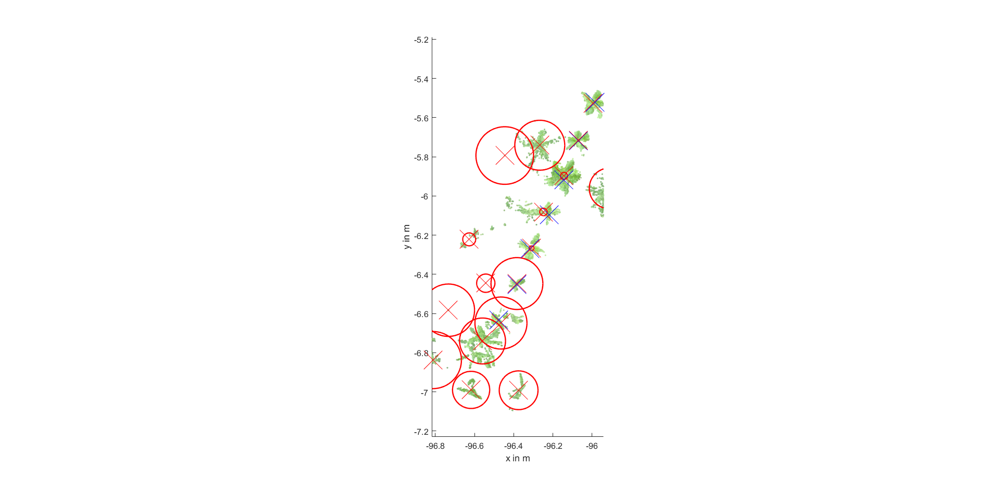
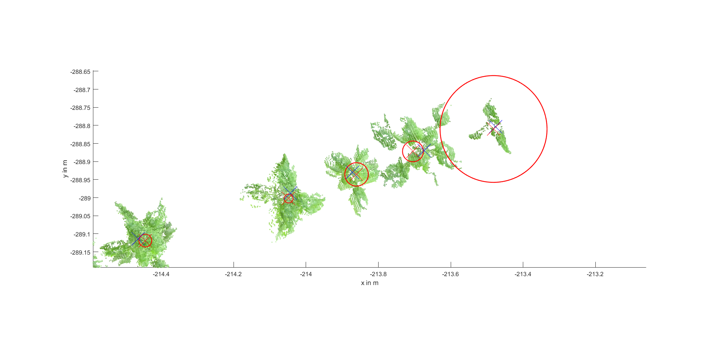
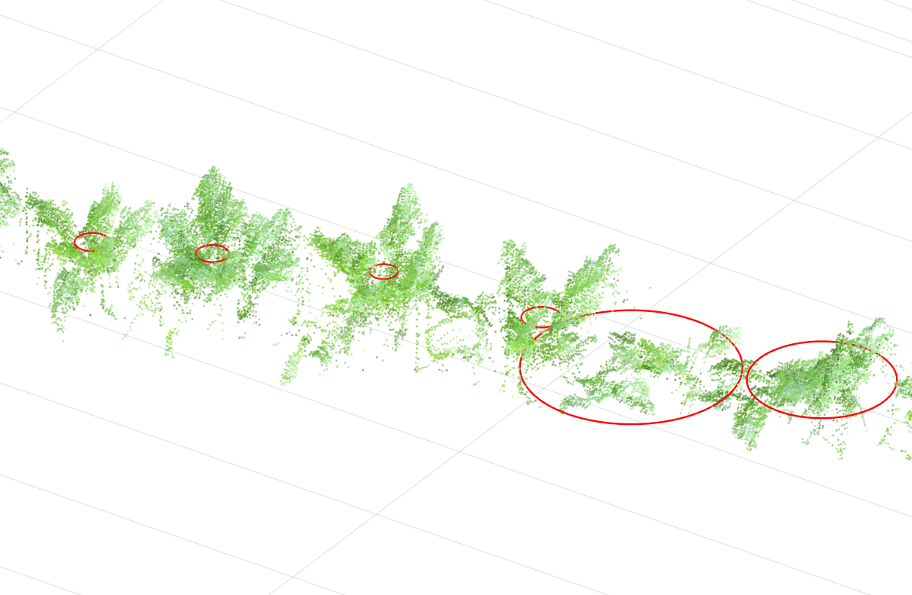
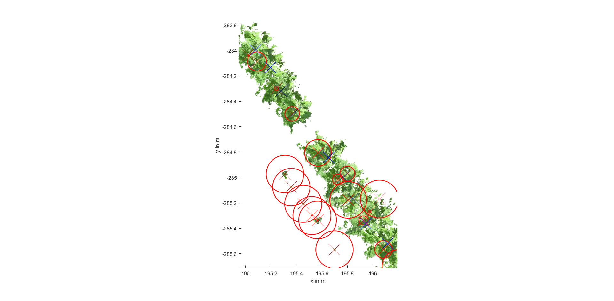
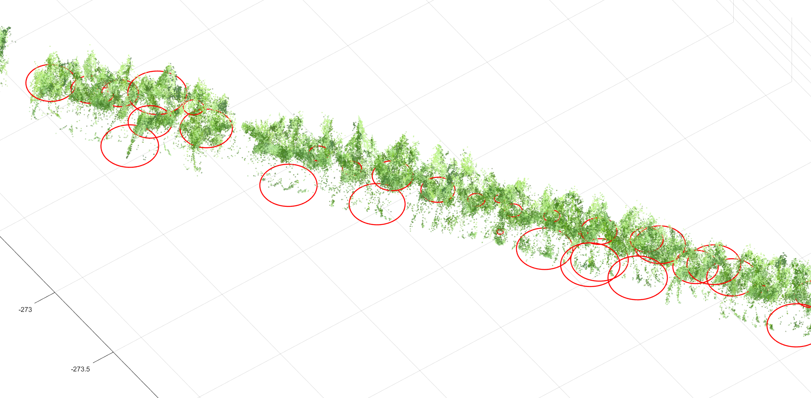

# Symmetry-Based Plant Detection in 3D Point Clouds from Crop Fields

This repository contains code to reproduce the experiments conducted for the paper "Symmetry-Based Plant Detection in 3D Point Clouds from Crop Fields"

The code is also available at codeocean https://codeocean.com/2018/05/14/symmetry-based-plant-detection-in-3d-point-clouds-from-crop-fields/. The codeocean capsule can be used to run `evaluation.m` in a defined environment and reproduce the results.

## Reproduction of paper results
The script `evaluation.m` will generate all figures from section III Experiments.

## Visualize algorithm results
The script `example.m` can be used to explore the results in an interactive way inside a Matlab figure window.

## Example results
Red crosses indicate SEP hypotheses found by MSC, blue crosses mark ground truth labels, circle radii correspond to the confidence values produced by our method (smaller radii for higher confidence).

### Dataset S

### Dataset M

### Dataset L

